# Geant4 Installation Guide for Windows

A complete step-by-step guide for installing Geant4 from source on Windows using CMake and Visual Studio 2022.

---

## Overview

This guide explains how to install Geant4 on Windows from source. It includes downloading and installing the required software, configuring the build system with CMake, compiling Geant4, installing the required datasets, and verifying the installation by running the Basic Example B1.

---

## System Requirements

| Software | Version |
|----------|---------|
| Operating System | Windows 11 |
| Visual Studio | 2022 |
| CMake | 4.3.1 |
| Geant4 | 11.4.1 |

---

## Installation Workflow

1. Install CMake
2. Install Visual Studio 2022
3. Download Geant4 Source
4. Configure Geant4 with CMake
5. Build and Install Geant4
6. Configure Environment Variables
7. Run Basic Example B1

---

## Complete Documentation

The complete installation guide is also available as a Microsoft Word document.

📄 **Geant4-Installation-Guide-Windows.docx**

---

# 1. Install CMake

## Purpose

CMake is required to configure and generate the Visual Studio project files used to build Geant4 from source.

## Download

Download the latest Windows installer from the official CMake website.

<https://cmake.org/download/>

## Installation

Run the installer and complete the installation using the default settings.

> **Important:** Enable the **"Add CMake to the system PATH"** option during installation.

## Verification

Open **Command Prompt** and run:

```powershell
cmake --version
```

Expected output:

```text
cmake version 4.3.1
```

## Screenshot

*Figure 1. Download page of the CMake installer.*

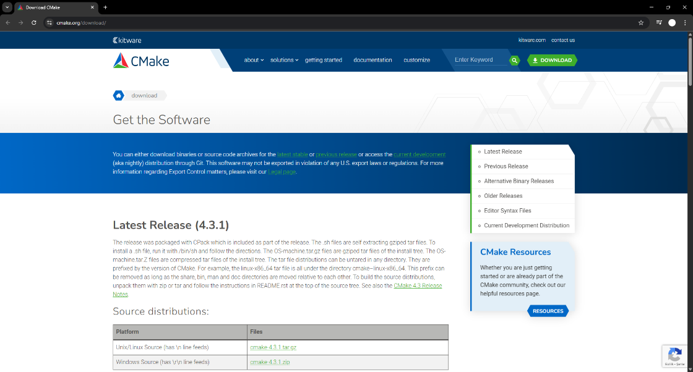

*Figure 2. CMake installation options.*

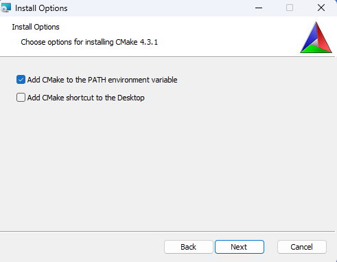

*Figure 3. Verification of the installed CMake version.*

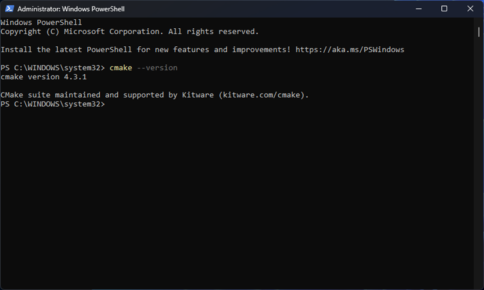


# 2. Install Visual Studio 2022

## Purpose

Visual Studio provides the Microsoft C++ compiler (MSVC) and build tools required to compile Geant4 on Windows.

## Download

Download Visual Studio 2022 Community Edition from the official Microsoft website.

<https://visualstudio.microsoft.com/>

## Required Workloads

During installation, select the following workload:

- Desktop development with C++

The following optional components are also recommended:

- MSVC v143 - VS 2022 C++ x64/x86 build tools
- Windows 11 SDK
- C++ CMake tools for Windows

## Installation

Complete the installation and restart your computer if prompted.

## Verification

Open **Developer Command Prompt for VS 2022** and run:

```powershell
cl
```

Expected output:

```text
Microsoft (R) C/C++ Optimizing Compiler
```

## Screenshot

*Figure 4. Visual Studio 2022 installation with the required C++ workload.*

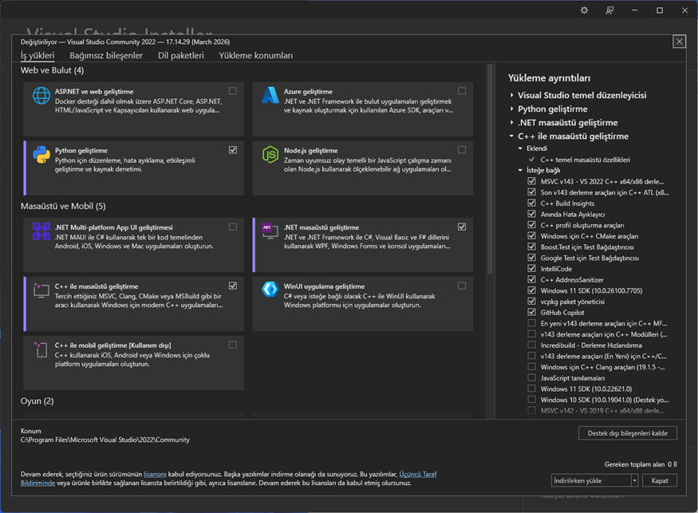


# 3. Download Geant4 Source Code

## Purpose

Download the official Geant4 source package and the required datasets.

## Download

Visit the official Geant4 website:

<https://geant4.web.cern.ch/>

Navigate to:

**Download → Source code**

Download the latest stable release of Geant4.

## Extract Files

After downloading, extract the source package to a convenient location.

Example:

```text
C:\
 ├── Geant4
 │    ├── geant4-v11.4.1
 │    ├── geant4-build
 │    └── geant4-install
```

It is recommended to keep the source, build, and installation directories separate.

## Notes

The **build** and **install** folders can be created manually before configuring the project with CMake.

## Screenshot

*Figure 5. Geant4 official download page.*

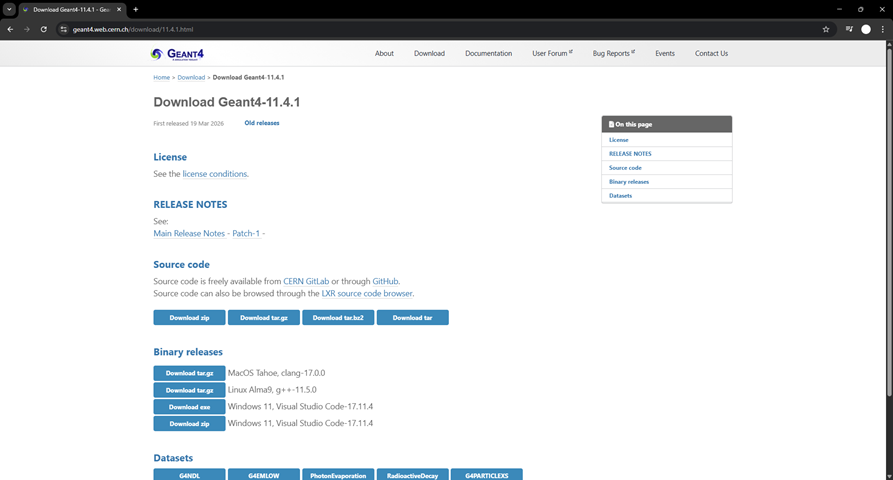

*Figure 6. Downloaded Geant4 source package.*

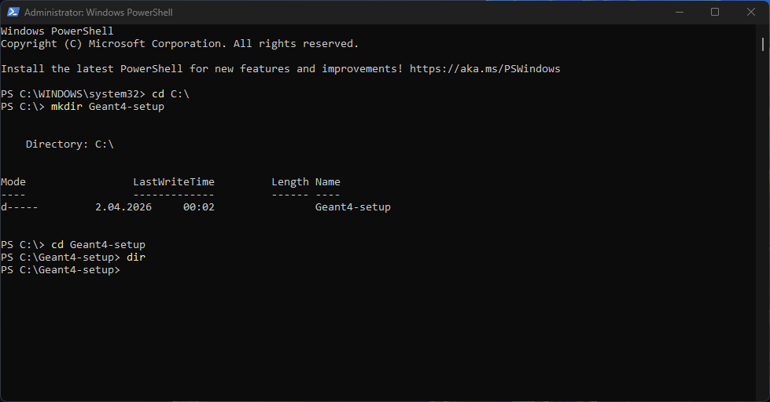

*Figure 7. Extracted Geant4 source directory.*

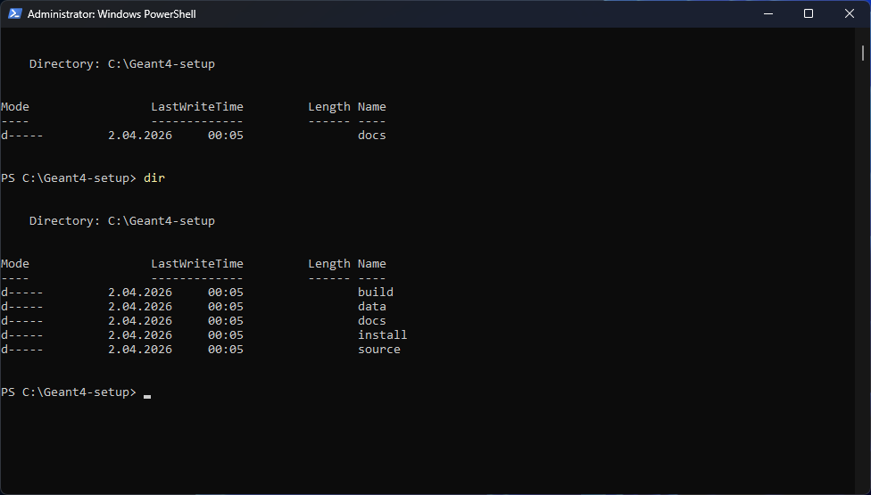

*Figure 8. Geant4 project folder structure.*

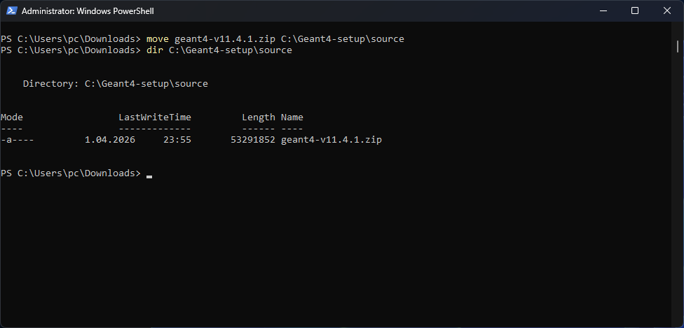

*Figure 9. Verification of the project directories.*

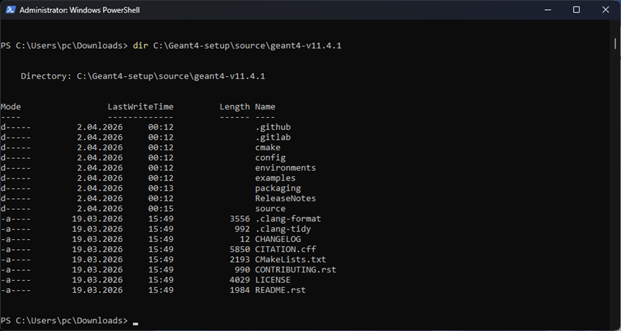


# 4. Configure Geant4 with CMake

## Purpose

Configure the Geant4 source code and generate the Visual Studio solution files.

## Create Build Directory

Create a separate build directory.

Example:

```text
C:\Geant4\geant4-build
```

## Configure

Open **Developer Command Prompt for VS 2022** and execute:

```powershell
cmake ../geant4-v11.4.1 ^
-G "Visual Studio 17 2022" ^
-A x64 ^
-DGEANT4_INSTALL_DATA=ON ^
-DGEANT4_USE_OPENGL_WIN32=ON ^
-DCMAKE_INSTALL_PREFIX=../geant4-install
```

## Result

If the configuration completes successfully, CMake will generate the Visual Studio solution files inside the build directory.

## Screenshot

*Figure 10. CMake configuration for Geant4.*

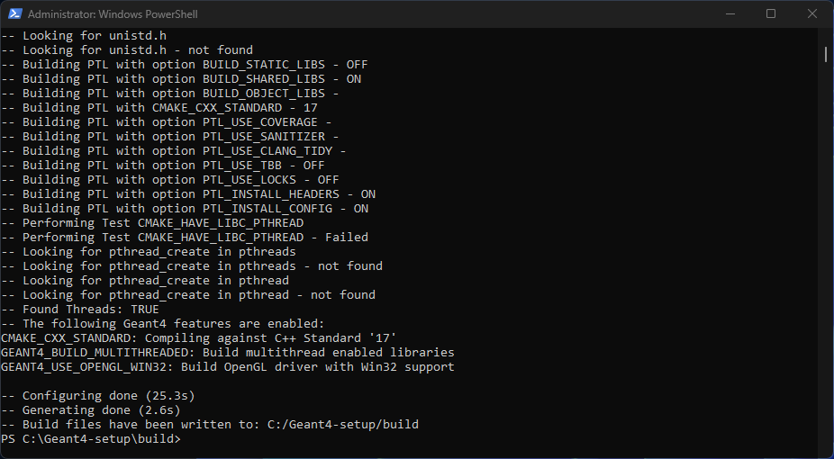


# 5. Build and Install Geant4

## Purpose

Compile the Geant4 source code and install the libraries into the installation directory.

## Open the Solution

Open the generated Visual Studio solution (`Geant4.sln`) located in the build directory.

## Build

In Visual Studio:

- Select **Release** configuration.
- Select **x64** platform.
- Build the **INSTALL** target.

Alternatively, build from the command line:

```powershell
cmake --build . --config Release --target INSTALL
```

## Result

After the build process is completed successfully, the Geant4 libraries, executables, and datasets will be installed in the installation directory.

Example:

```text
C:\Geant4\geant4-install
```

## Screenshot

*Figure 11. Building the Geant4 project in Visual Studio.*

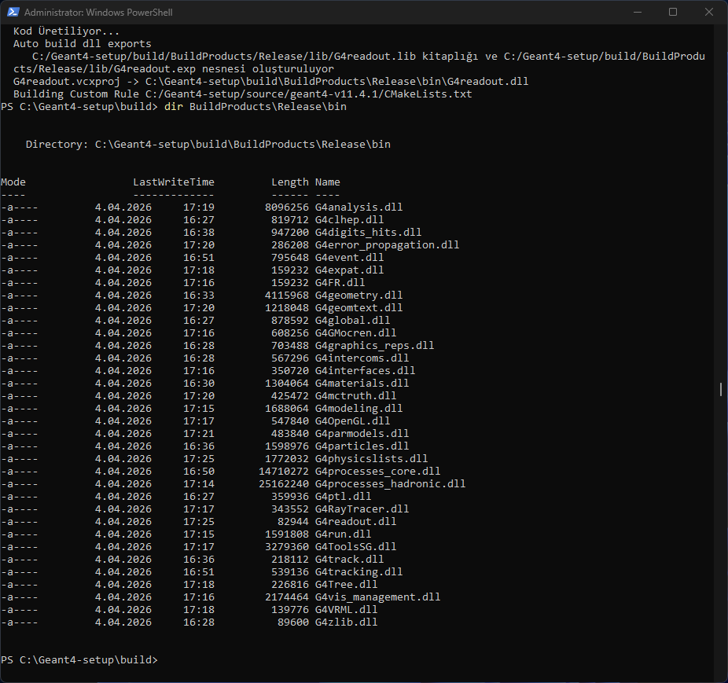

*Figure 12. Successful installation of Geant4.*

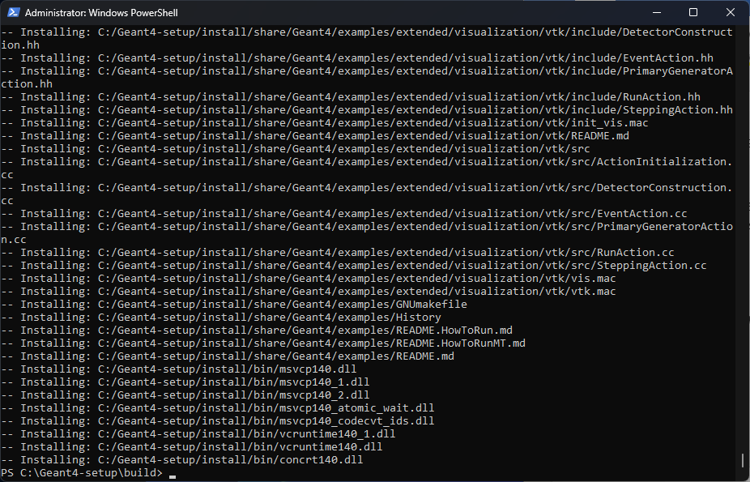


# 6. Configure Environment Variables

## Purpose

Configure the required environment variables so that Geant4 can be used from the command line.

## Open Geant4 Command Prompt

Navigate to the Geant4 installation directory and run the environment setup script.

Example:

```powershell
geant4-install\bin\geant4.bat
```

Alternatively, use the Geant4 Command Prompt if it has been created during installation.

## Verification

Verify that Geant4 is configured correctly by running:

```powershell
geant4-config --version
```

or launch one of the Geant4 examples.

## Screenshot

*Figure 13. Geant4 environment configuration.*

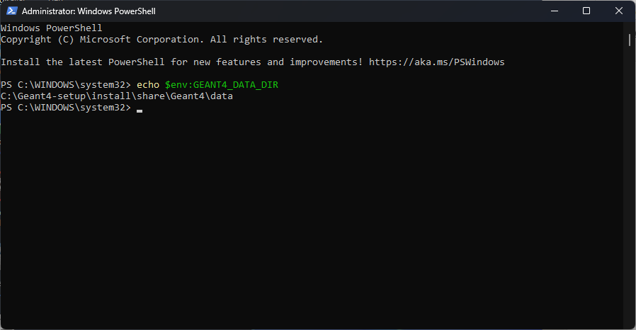

# 7. Run the Basic Example (B1)

## Purpose

Run the Geant4 Basic Example B1 to verify that the installation has been completed successfully.

## Navigate to the Example Directory

Example:

```text
geant4-install/
└── share/
    └── Geant4/
        └── examples/
            └── basic/
                └── B1
```

## Build the Example

Create a build directory inside the B1 example folder and configure it using CMake.

Example:

```powershell
cmake ..
cmake --build . --config Release
```

## Run the Example

Execute the generated application.

If Geant4 is installed correctly, the visualization window should open without errors.

## Expected Result

A successful execution confirms that Geant4 has been installed and configured correctly.

## Screenshot

*Figure 14. Configuring the Basic Example B1 project.*

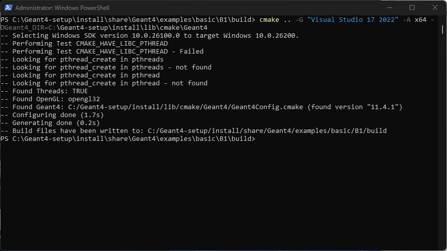

*Figure 15. Successful execution of the Geant4 Basic Example B1.*

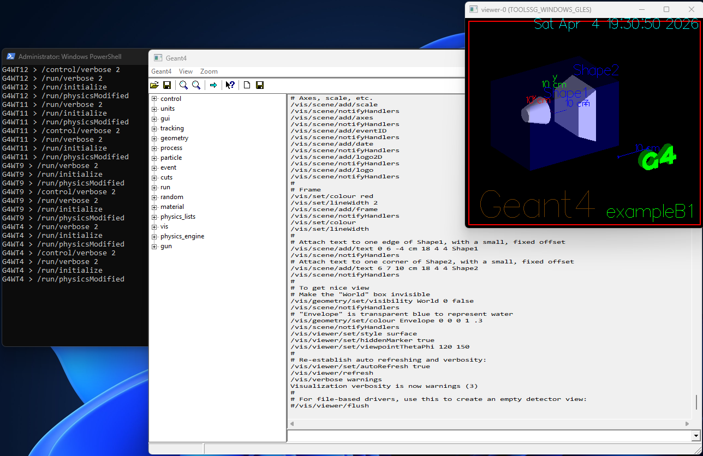

# Troubleshooting

## Common Issues

### CMake cannot find Visual Studio

- Make sure Visual Studio 2022 is installed.
- Open the **Developer Command Prompt for VS 2022** before running CMake.

---

### Missing Physics Datasets

Reconfigure Geant4 with:

```powershell
-DGEANT4_INSTALL_DATA=ON
```

and rebuild the project.

---

### Build Errors

Check that:

- CMake version is correct.
- Visual Studio 2022 is installed.
- Windows SDK is available.
- MSVC C++ build tools are installed.

---

### Visualization Does Not Open

Verify that Geant4 was configured with visualization support enabled.

Example:

```powershell
-DGEANT4_USE_OPENGL_WIN32=ON
```---

# References

- Geant4 Official Website  
  https://geant4.web.cern.ch/

- CMake Official Website  
  https://cmake.org/

- Microsoft Visual Studio  
  https://visualstudio.microsoft.com/


*Last updated: July 2026*
